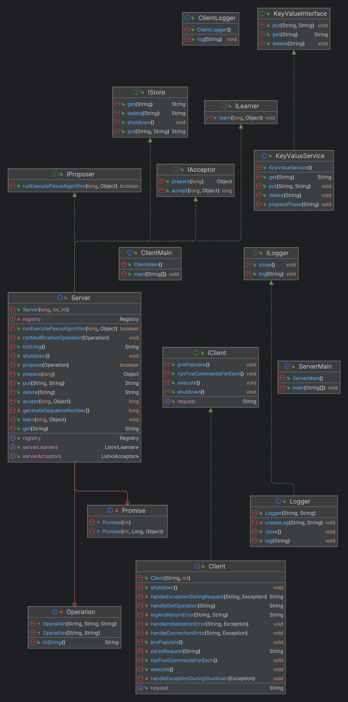

## Excutive Summary:

### 1. Assignment Overview:
The purpose of Project #3 is to enhance the robustness, scalability, reliability and availability of a Key-Value Store through replication and consistency mechanisms. This project extends the single-instance KVS developed in Project #2 into a distributed system consisting of five replicated servers. The primary goal is to ensure that the system can handle client requests with higher bandwidth and provide uninterrupted service by distributing the load across multiple server instances. Clients should interact with any of the five replicas to perform GET, PUT, and DELETE operations without experiencing inconsistencies in the stored data. A critical aspect of this project is to maintain data consistency across all replicas, especially when handling PUT and DELETE operations. To achieve this, a two-phase commit (2PC) protocol is implemented, ensuring that updates are atomic and all replicas remain in sync. The assumption here is that server failures are unlikely, so the focus is on the correct implementation of the 2PC protocol, including timeout mechanisms to handle potential stalls in the commit process. 

### 2. Technical Impression:
The process of transforming a single-instance Key-Value store into a replicated, distributed system presented both challenges and learning opportunities. Implementing replication required a deep understanding of distributed system principles, particularly in ensuring that client interactions remain seamless and transparent regardless of the underlying changes. The choice to use Remote Procedure Calls (RPC) for server intercommunication streamlined the development process, providing a relatively straightforward method for invoking operations across the network. The process of implementing this was quite interesting to me as I had never developed a distributed system like this before.

Integrating the two-phase commit protocol introduced complexities, particularly in handling edge cases and ensuring the system could gracefully manage partial failures or network issues. Developing timeout mechanisms and handling ACKs required careful consideration to avoid deadlocks or indefinite stalls. This was particularly useful throughout the development process since I kept running into issues when distributing the load.

The experience highlighted the importance of designing with fault tolerance and scalability in mind from the outset. Balancing the load across multiple servers and ensuring data consistency without significantly impacting performance proved challenging but ultimately rewarding. I wanted to learn the inner workings of such a system, and so I was happy to have been introduced to the process. The project underscored the critical role of distributed systems in building resilient, scalable applications and provided practical experience in implementing key concepts such as replication, consistency models, and coordinated commit protocols in a real-world scenario, just as one would encounter in industry.

### 3. Use Case / Application:

In the Biotech industry (the industry I currently operate within), an RPC-based system distributed across multiple servers can revolutionize drug discovery processes through high-throughput screening (HTS) automation. By connecting robotic systems, data analysis software, and compound databases across a distributed network, researchers can efficiently test thousands of chemical compounds for potential drug activity against biological targets. This system allows for parallel processing of data, significantly accelerating analysis and identification of promising drug candidates. Leveraging RPC for real-time patient monitoring and data analysis in clinical trials can significantly enhance the efficiency, reliability, and scalability of trial data management systems. By facilitating seamless and secure communication between distributed components, RPC-based systems can accelerate the pace of clinical trials, ensuring faster time-to-market for critical healthcare innovations.