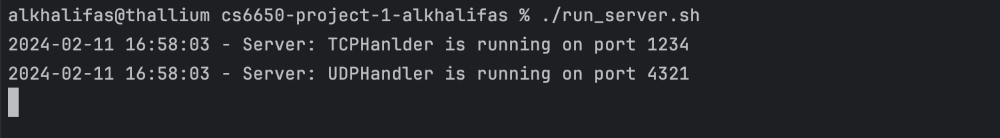
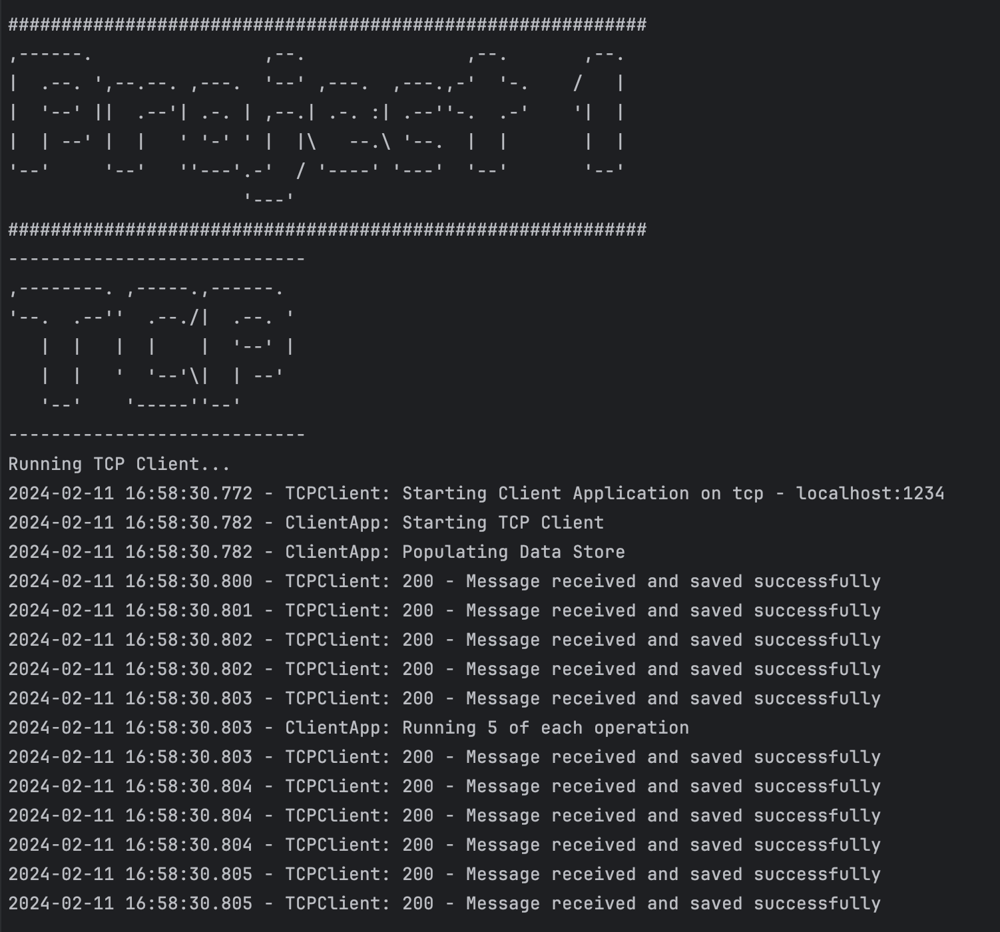
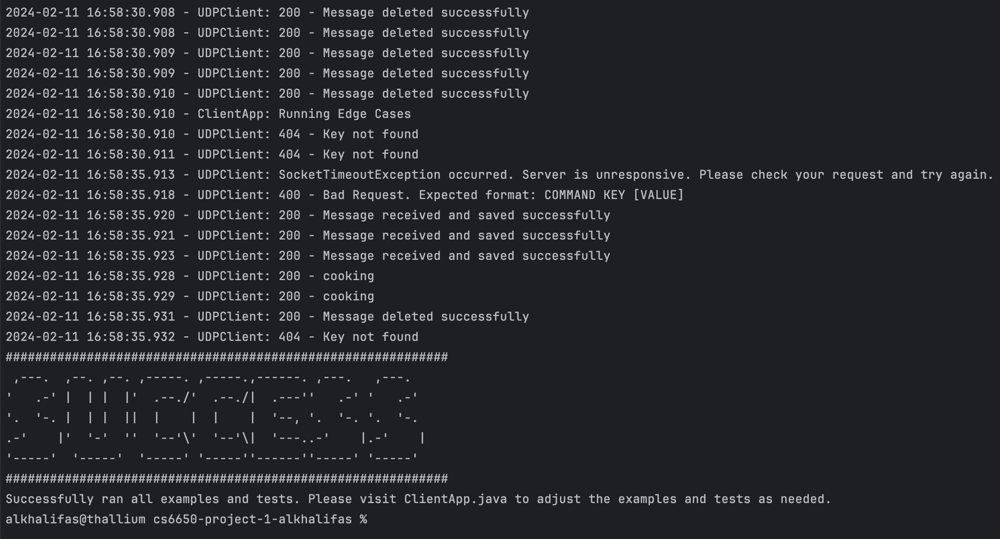
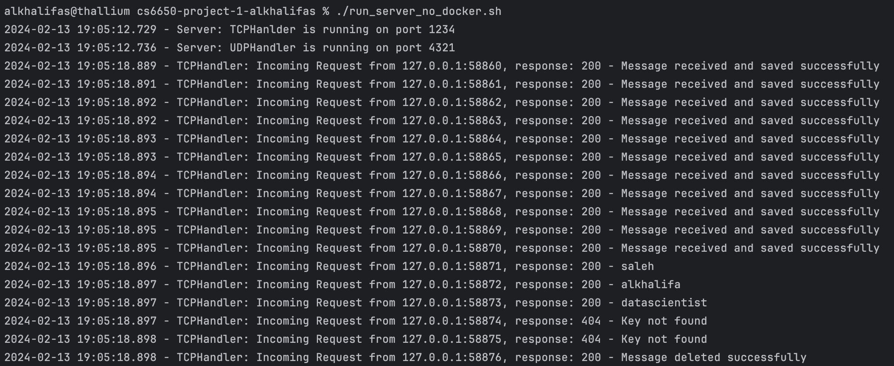
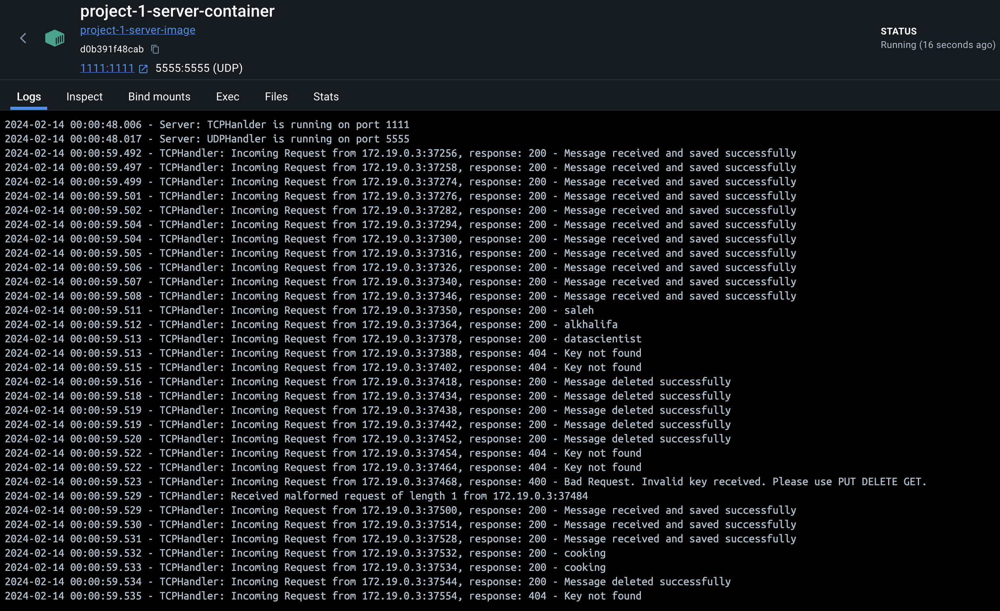
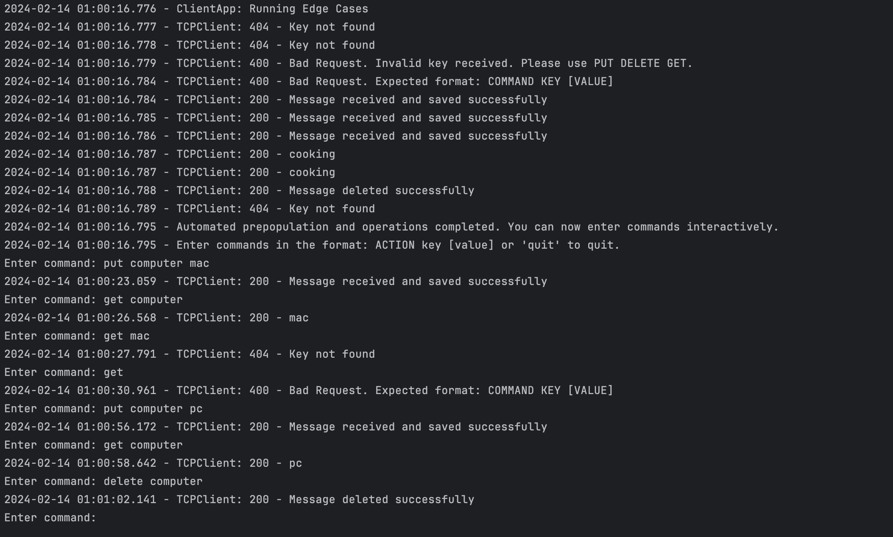

# Single Server, Key-Value Store (TCP and UDP)
### CS 6650 Northeastern University
### Spring 2024

### Requirements:
- [X] Make the client interactive
- [X] Docker is optional, but not required
- [X] Follow directory structure from guidelines
- [X] Create a run_client.sh file
- [X] You must also use two distinct L4 communication protocols
- [X] Your implementation may be written in Java
- [X] Your source code should be well-factored and well-commented.
- [X] The client must take the following command line arguments hostname/IP and Port and protocol
- [X] The client should be robust to server failure by using a timeout mechanism
- [X] if it does not receive a response to a particular request, you should note it in a client log and send the remaining requests
- [X] You will have to design a simple protocol to communicate packet contents
- [X] Three request types along with data passed along as part of the requests
- [X] The client must be robust to malformed or unrequested datagram packets
- [X] If it receives such a datagram packet, it should report it in a human-readable way
- [X] Every line the client prints to the client log should be time-stamped with the current system time
- [X] You may format the time any way you like as long as your output maintains millisecond precision
- [X] You must have two instances of your client (or two separate clients)
- [X] The server must take the following command line arguments: port numbers for TCP and UDP
- [X] The server should run forever (until forcibly killed by an external signal, such as a Control-C
- [X] The server must display the requests received, and its responses, both in a human readable
- [X] that is, it must explicitly print to the server log that it received a query from a particular InetAddress and port number
- [X] The server must be robust to malformed datagram packets
- [X] If it receives a malformed datagram packet, it should report it in a human-readable way (length + address:port)
- [X] Every line the server prints to standard output or standard error must be time-stamped with the current system time (i.e., System.currentTimeMillis()).
- [X] You may format the time any way you like as long as your output maintains millisecond precision
- [X] You must have two instances of your server (or two separate servers)
- [X] You should use your client to pre-populate the Key-Value store with data and a set of keys.
- [X] Once the key-value store is populated, your client must do at least five of each operation: 5 PUTs, 5 GETs, 5 DELETEs.
- [X] Create an executive summary comprising “Assignment overview”, “technical impression”, and three use cases to apply this in practice.
- [X] “Assignment overview” (1 paragraph, up to about 250 words) explaining what you understand to be the purpose and scope of the assignment
- [X] “technical impression” (1–2 paragraphs, about 200–500 words) describing your experiences while carrying out the assignment.
- [X] Provide a use case (application) 3 where you would apply this in practice.
- [X] Attach screenshots of your testing done on your local environment.

### Instructions:

There are three methods to run the code for your convenience.

#### 1. Quick Start:

Compile the Java code:

    cd src
    javac server/*.java client/*.java

Run the Server:

    cd src
    java server.ServerApp 1234 4321 

Run the Client:

    cd src
    java client.ClientApp localhost 1234 tcp
    java client.ClientApp localhost 4321 udp

#### 2. Quick Start Scripts:

Alternatively, you can run the .sh files instead:

    chmod +x run_server_no_docker.sh
    ./run_server_no_docker.sh

    chmod +x run_client_no_docker.sh
    ./run_client_no_docker.sh

#### 3. Run Docker:

    cd src
    sudo ./deploy.sh
    sudo docker build -t project-1-client-image --target client-build .

    sudo ./run_client.sh project-1-client-container 1111 tcp
    sudo ./run_client.sh project-1-client-container 5555 udp

### Screen Shots:

Starting the server:

Running Client Executable:

End of the Client Executable:

Server Logs:

Docker Server Logs:

Docker Client Output:
