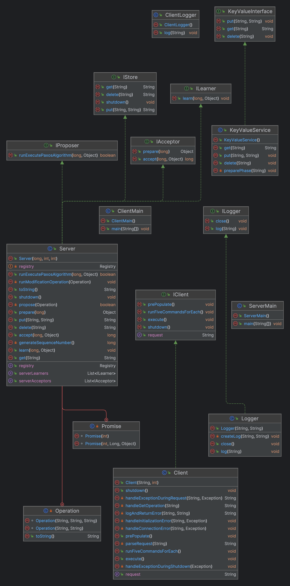
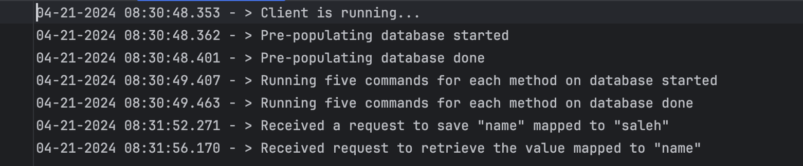

# Project 3: Multi-threaded Key-Value Store using RPC
### CS 6650 Northeastern University
### Spring 2024

### Project 3 New Requirements:
- [X] Replicate your Key-Value Store Server across 5 distinct servers.
- [X] to increase Server bandwidth and ensure availability, you need to replicate your key-value store at each of 5 different instances of your servers.
- [X] Note that your client code should not have to change radically
- [X] Clients should be able to contact any of the five KV replica servers instead of a single server and get consistent data back from any of the replicas (in the case of GETs).
- [X] You client should also be able to issue PUT operations and DELETE operations to any of the five replicas.
- [X] On PUT or DELETE operations you need to ensure each of the replicated KV stores at each replica is consistent.
- [X] To do this, you need to implement a two-phase protocol for updates.
- [X] We will assume no servers will fail such that 2 Phase Commit will not stall
- [X] Although you may want to defensively code your 2PC protocol with timeouts to be sure.
- [X] Consequently, whenever a client issues a PUT or a DELETE to *any* server replica, that receiving replica will ensure the updates have been received (via ACKs) and commited (via Go messages with accompanying ACKs).

### Project 1 & 2 Remaining Requirements:
- [x] You need to enable your client and server to communicate using Remote Procedure Calls (RPC) instead of sockets
- [x] If you’ve implemented Project #1 in Java, you may want to look into and leverage Java RMI for RPC communication
- [x] You need to make your server multi-threaded such that you can handle multiple outstanding client requests at once.
- [x] The key result is that your servers should be able to handle requests from multiple running instances of you client doing concurrent PUT, GET, and DELETE operations.
- [x] Due to the addition of multi-threading, you will need to handle mutual exclusion.
- [x] Make the client interactive
- [ ] Docker is optional, but not required
- [x] Follow directory structure from guidelines
- [x] Create a run_client.sh file
- [x] Your implementation may be written in Java
- [x] Your source code should be well-factored and well-commented.
- [x] The client must take the following command line arguments hostname/IP and Port and protocol
- [x] if it does not receive a response to a particular request, you should note it in a client log and send the remaining requests
- [x] You will have to design a simple protocol to communicate packet contents
- [x] Three request types along with data passed along as part of the requests
- [x] The client must be robust to malformed or unrequested datagram packets
- [x] If it receives such a datagram packet, it should report it in a human-readable way
- [x] Every line the client prints to the client log should be time-stamped with the current system time
- [x] You may format the time any way you like as long as your output maintains millisecond precision
- [x] The server should run forever (until forcibly killed by an external signal, such as a Control-C
- [x] The server must display the requests received, and its responses, both in a human readable
- [x] The server must be robust to malformed datagram packets
- [x] If it receives a malformed datagram packet, it should report it in a human-readable way (length + address:port)
- [x] Every line the server prints to standard output or standard error must be time-stamped with the current system time (i.e., System.currentTimeMillis()).
- [x] You may format the time any way you like as long as your output maintains millisecond precision
- [x] You should use your client to pre-populate the Key-Value store with data and a set of keys.
- [x] Once the key-value store is populated, your client must do at least five of each operation: 5 PUTs, 5 GETs, 5 DELETEs.
- [x] Create an executive summary comprising “Assignment overview”, “technical impression”, and three use cases to apply this in practice.
- [x] “Assignment overview” (1 paragraph, up to about 250 words) explaining what you understand to be the purpose and scope of the assignment
- [x] “technical impression” (1–2 paragraphs, about 200–500 words) describing your experiences while carrying out the assignment.
- [x] Provide a use case (application) 3 where you would apply this in practice.
- [x] Attach screenshots of your testing done on your local environment.

### Instructions:

There are three methods to run the code for your convenience.

#### 1. Quick Start:

Compile the Java code:

    cd src
    coordinator/*.java server/*.java utils/*.java main/ServerMain.java
    client/*.java utils/*.java main/ClientMain.java

Run the Server:

    cd src
    java main.ServerMain

Run the Client:

    cd src
    java main.ClientMain

#### 2. Quick Start Scripts (No Docker):

Alternatively, you can run the .sh files instead:

    chmod +x run_server_no_docker.sh
    ./run_server_no_docker.sh

    chmod +x run_client_no_docker.sh
    ./run_client_no_docker.sh

### Screen Shots:

Class Diagram:

Starting Client:

Starting Server:

Client Logs:

Docker Containers:

